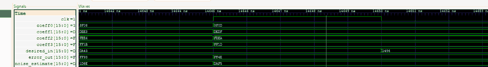
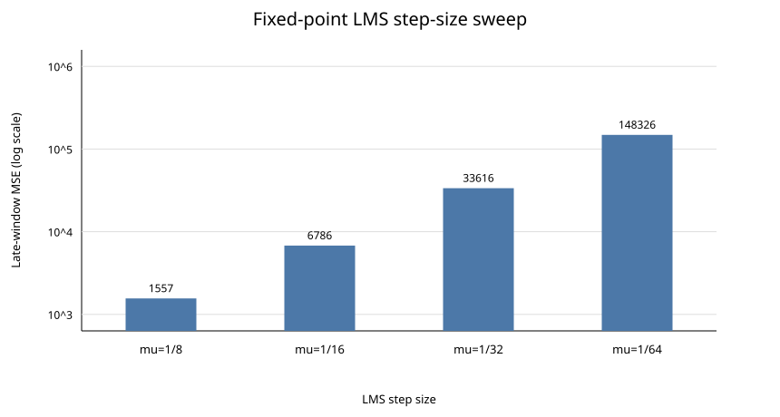

# Fixed-Point LMS Adaptive Filter RTL

4-tap LMS adaptive filter in Verilog using signed Q1.15 fixed-point arithmetic.

This started as a basic fixed-coefficient FIR and I later changed it into an actual LMS filter with coefficient updates, saturation and a convergence test.

## Design

```text
y[n] = sum(w_i[n] * x[n-i])
e[n] = d[n] - y[n]
w_i[n+1] = w_i[n] + mu * e[n] * x[n-i]
```

Current implementation:

- 16-bit signed Q1.15 samples and coefficients
- 4 taps
- default `mu = 1/16`
- wider multiply/accumulate path
- saturation back to 16-bit Q1.15

RTL: [`rtl/lms_adaptive_filter.v`](rtl/lms_adaptive_filter.v)

Fixed-point notes: [`docs/fixed_point_and_algorithm.md`](docs/fixed_point_and_algorithm.md)

## RTL verification

The testbench builds a hidden 2-tap path:

```text
h0 = +0.5
h1 = -0.25

d[n] = 0.5*x[n] - 0.25*x[n-1]
```

The adaptive filter starts with all coefficients at zero and runs for 3000 pseudo-random samples.

One run gives:

```text
Early-window mean squared error : 1641547
Late-window mean squared error  : 6786
Learned coefficients (Q1.15)    : 16179, -8414, -216, -192
Expected approximately          : 16384, -8192, 0, 0

PASS: LMS adaptation and convergence verified.
```

Late-window MSE is about 242x lower than the early window.




## C reference model

I added a small C model in `model/lms_reference.c` using the same fixed-point scaling, LFSR input sequence and hidden 2-tap path as the RTL test.

It is useful as a second implementation of the algorithm, not another Verilog testbench.

```bash
make reference
```

Current C output matches the RTL run:

```text
C reference model
early MSE : 1641547
late MSE  : 6786
coeffs    : 16179, -8414, -216, -192
```

## Step-size experiment

`model/lms_mu_sweep.py` runs the same deterministic fixed-point problem with four LMS step sizes: `1/8`, `1/16`, `1/32` and `1/64`.

```bash
make experiment
```

The run shows the expected convergence tradeoff. In this test, larger step sizes adapt faster during the fixed 3000-sample window, while smaller values are still approaching the hidden coefficients.

| mu | early MSE | late MSE | MSE reduction | final coefficients |
|---:|---:|---:|---:|---|
| 1/8 | 256173 | 1557 | 22.16 dB | `[16281, -8297, -106, -96]` |
| 1/16 | 1641547 | 6786 | 23.84 dB | `[16179, -8414, -216, -192]` |
| 1/32 | 5678045 | 33616 | 22.28 dB | `[15946, -8684, -476, -408]` |
| 1/64 | 12828515 | 148326 | 19.37 dB | `[15345, -9174, -932, -805]` |



Full results: [`results/mu_sweep.md`](results/mu_sweep.md)

This is not a claim that one `mu` is universally best. LMS stability and convergence depend on the input power, correlation, filter length and fixed-point scaling.

GitHub Actions runs the original RTL simulation, C reference, step-size experiment, acoustic ANC/path-change experiment and the 4,096-sample bit-exact RTL parity test.

## Acoustic ANC and path-change experiment

The original self-checking test proves system identification. I added a second deterministic experiment that is closer to adaptive noise cancellation:

```text
primary d[n] = clean signal + correlated noise after an unknown path
reference x[n] = noise source before that path
error e[n] = cleaned output
```

The hidden four-tap noise path changes at sample 10,000, so the filter has to adapt again instead of only converging once.

For the current RTL default `mu = 1/16`:

- input SNR is about 1.70 dB before the path change and 0.47 dB after it;
- output SNR reaches 18.50 dB before and 18.21 dB after;
- that is about 16.80 dB and 17.74 dB improvement;
- the fixed-point model recovers to at least 15 dB output SNR in about 2800 samples after the path change;
- no output, error or coefficient saturation occurs in the tested amplitude envelope.

In this workload `mu = 1/32` gives better steady-state SNR, but takes longer to re-track the changed path. That result is deliberately kept separate from the earlier system-identification sweep; it is not a universal replacement for the RTL default.

The simulation also includes an uncorrelated-reference negative control. As expected, it produces essentially no SNR improvement, which checks that the model is not reporting cancellation when the reference contains no useful noise information.

Results: [`results/anc_system_sim.md`](results/anc_system_sim.md)

Method and limits: [`docs/anc_verification.md`](docs/anc_verification.md)

## Bit-exact acoustic-vector RTL parity

A second self-checking test generates 4,096 Q1.15 acoustic-style samples and the exact expected output, error and coefficient trace from the Python fixed-point model. The real Verilog core must match all six values sample-by-sample:

```text
noise_estimate
error_out
coeff0
coeff1
coeff2
coeff3
```

Run it with:

```bash
make rtl-parity
make serial-parity
make synthesis-report
```

This catches arithmetic-shift, saturation and coefficient-update-order mismatches that can be missed by checking only final coefficients.

## Hardware architecture comparison

The repository now includes a second LMS implementation that deliberately reuses one signed 16x16 multiplier:

- current `lms_adaptive_filter.v`: parallel arithmetic, one accepted sample per clock;
- `lms_adaptive_filter_serial.v`: one shared multiplier, four FIR cycles plus four coefficient-update cycles, with a nine-clock initiation interval.

The serialized core is not accepted just because it synthesizes smaller. It is replayed against the same 4,096-sample bit-exact acoustic vector set used for the parallel RTL, so its output, error and final adaptive state have to match the reference exactly.

`scripts/run_synthesis.sh` runs generic Yosys synthesis for both architectures and generates:

```text
results/synthesis_compare.json
results/synthesis_compare.md
```

The report compares logical multiplier/add/mux/register cells, generic post-synthesis cell count and arithmetic sample throughput. These are **generic Yosys numbers**, not FPGA LUT/DSP/Fmax measurements.

Method and interpretation: [`docs/architecture_synthesis.md`](docs/architecture_synthesis.md)

## Run

```bash
make test
make reference
make experiment
make anc-experiment
make rtl-parity
```

Waveform:

```bash
make wave
```

## Structure

```text
rtl/
  lms_adaptive_filter.v
  lms_adaptive_filter_serial.v

tb/
  tb_lms_adaptive_filter.v
  tb_lms_vector_parity.v
  tb_lms_serial_parity.v

model/
  lms_reference.c
  lms_mu_sweep.py
  anc_system_sim.py
  generate_rtl_parity_vectors.py
  synthesis_report.py

results/
  mu_sweep.csv
  mu_sweep.md
  mu_sweep.svg
  anc_system_sim.csv
  anc_system_sim.json
  anc_system_sim.md
  rtl_parity_manifest.json
  synthesis_compare.json
  synthesis_compare.md

docs/
  fixed_point_and_algorithm.md
  anc_verification.md
  architecture_synthesis.md
  images/

.github/workflows/
  verilog-ci.yml

Makefile
```

## Scope

This is the adaptive-filter RTL core and verification setup. It is not a complete acoustic ANC system with microphones, ADC/DAC and speakers.

A useful later step would be synthesis/timing/resource measurements or FPGA testing, not just adding more taps for no reason.

## License

MIT License. See [`LICENSE`](LICENSE).
